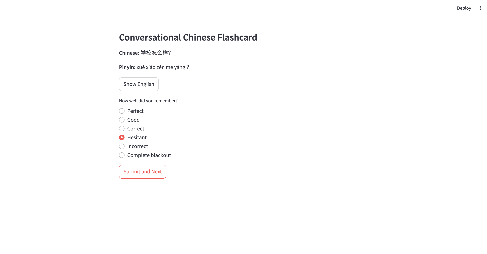
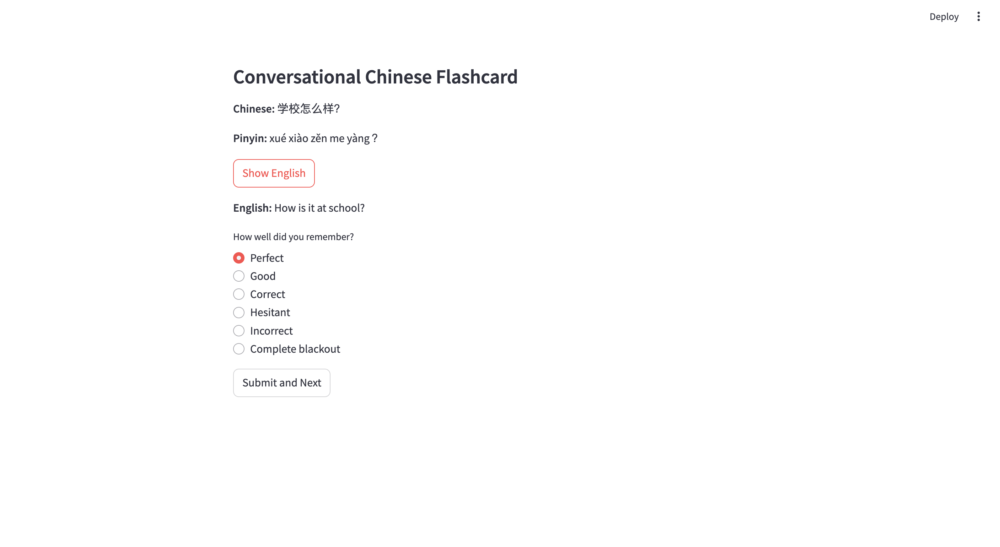

# Chinese Study App

A simple Streamlit-based spaced-repetition application to study Chinese phrases, using the [ManyThings](https://www.manythings.org/anki/) dataset.





## Installation

```bash
$ cd ~
```
```bash
$ git clone https://github.com/adamcatto/chinese_study_app
```

```bash
$ cd chinese_study_app
```

(activate your conda environment)
```bash
$ pip install -r requirements.txt
```

This will install `chinese_study_app` to your home directory.

## Running

```bash
$ cd ~/chinese_study_app
```

```bash
$ streamlit run app.py
```

This will take you to your browser, and open up the Streamlit-based webpage.

## Notes

Currently, it only supports Mandarin Chinese phrases w/ written characters and pinyin as card fronts, and English as card backs, but in the works are:

* Scrape actual phrases/sentences from the internet/talkshows/interviews/etc.

* Allow stratification by length of phrase/sentences

* Cantonese Option

* Arbitrary languages from [ManyThings](https://www.manythings.org/anki/)

* Validate that spaced repetition works

* Allow you to explore cards

* Naturalistic synthetic voice to speak the Chinese, so you can hear how the tones are supposed to be pronounced

* Create your own local profile to track progress

* Progress / metrics visualization

## Contributing

Please feel free to contribute new features, data, etc.